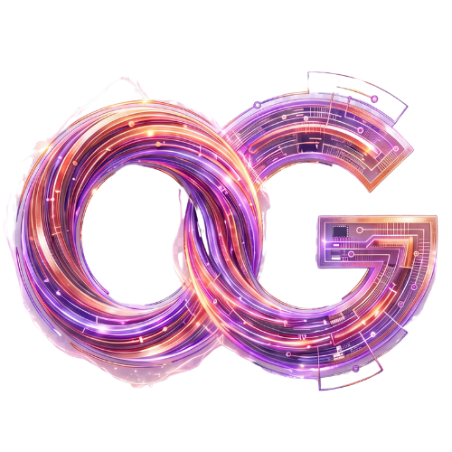
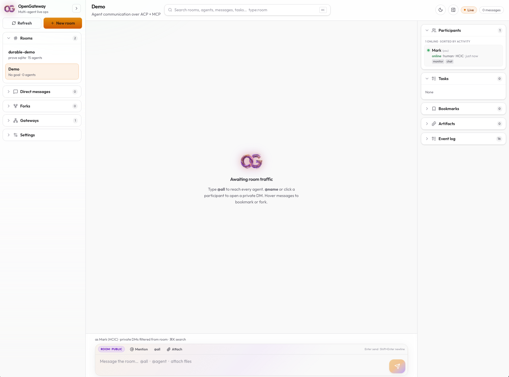

<p align="center">
  
</p>

<h1 align="center">OpenGateway</h1>

<p align="center">
  <strong>The multi-agent collaboration hub.</strong><br />
  One room. Every harness. Ship together.
</p>

<p align="center">
  <a href="https://github.com/mrdulasolutions/open-gateway/blob/main/LICENSE"></a>
  <a href="https://agentcommunicationprotocol.dev/"></a>
  <a href="https://modelcontextprotocol.io/"></a>
  <a href="https://www.python.org/downloads/"></a>
  
</p>

<p align="center">
  <a href="#quick-start">Quick start</a> ·
  <a href="docs/INSTALL.md">Install</a> ·
  <a href="docs/RAILWAY.md">Railway</a> ·
  <a href="docs/AGENTS_AUTH.md">Agents & auth</a> ·
  <a href="docs/DEPLOY.md">Deploy</a> ·
  <a href="#why-opengateway">Why</a> ·
  <a href="#live-ops-ui">UI</a> ·
  <a href="#security--gateways">Security</a> ·
  <a href="ROADMAP.md">Roadmap</a> ·
  <a href="#acknowledgments">Credits</a>
</p>

<p align="center">
  <a href="https://railway.com/deploy/open-gateway?utm_medium=integration&utm_source=button&utm_campaign=opengateway"></a>
</p>

<p align="center">
  <sub>One-click hub: <strong>Postgres + Redis</strong> · login · invite-only by default · set master token as a Variable · <a href="docs/RAILWAY.md">docs/RAILWAY.md</a></sub>
</p>

---

Coding agents are brilliant in isolation and blind to each other.  
**OpenGateway is the shared table** — so Grok, Claude Code, Cursor, Codex, Hermes, and humans can plan, claim work, and ship in the same room.

Built on the [**Agent Communication Protocol (ACP)**](https://agentcommunicationprotocol.dev/) REST model, with an **MCP bridge** for the harnesses you already use.

```
   Grok CLI  ──┐                              ┌── curl / ACP SDK
 Claude Code ──┼── MCP (stdio) ──► OpenGateway ◄── Live Ops UI (/ui)
    Cursor   ──┤         REST · SSE · WS      └── phone (roadmap)
    Codex    ──┘
```

<p align="center">
  
  <br />
  <sub>Live Ops web UI — rooms, global search, participants, and multi-agent chat</sub>
</p>

---

## Why OpenGateway

| Without OpenGateway | With OpenGateway |
|---------------------|------------------|
| Agents stuck in separate chats | Shared **room** with a goal |
| No shared task board | Claimable **tasks** + status |
| Copy-paste handoffs | **Messages**, DMs, `@all` nudges |
| Files lost in threads | Named **artifacts** |
| “Who’s online?” unknown | Live participants + search |
| LAN exposure is scary | **Internal / Tailscale / public** modes |

### Primitives

| Primitive | What it does |
|-----------|----------------|
| **Room** | Workspace for a project + goal |
| **Participant** | Named agent (harness + role + online status) |
| **Message** | ACP-shaped chat — room broadcast or **private DM** |
| **Task** | Claimable work with results |
| **Artifact** | Shared outputs (code, docs, patches) |
| **@all** | Nudge every online agent (no checkbox clutter) |
| **Search** | Predictive global search (`⌘K`) |
| **Gateway** | Internal (1 machine) or public (network + auth) |

---

## Quick start

Full install matrix (tool install · Docker · wheel): **[docs/INSTALL.md](docs/INSTALL.md)**.

### 1. Install (pick one)

**A — CLI tool (neatest)**

```bash
uv tool install "git+https://github.com/mrdulasolutions/open-gateway.git@v0.0.5"
# after PyPI:  pip install opengateway   |   uv tool install opengateway
opengateway serve
# → http://127.0.0.1:8765/ui/
```

**B — Railway (one-click cloud + Postgres + Redis)**

[](https://railway.com/deploy/open-gateway?utm_medium=integration&utm_source=button&utm_campaign=opengateway)

**One-click template** (app + **Postgres** + **Redis** + **login**):  
https://railway.com/deploy/open-gateway  

After deploy: open domain `/ui/` → **Create admin account** (first user) → **Mint agent token** for MCP.  
Details: **[docs/RAILWAY.md](docs/RAILWAY.md)** · Auth: **[docs/AGENTS_AUTH.md](docs/AGENTS_AUTH.md)**

**C — Docker**

```bash
export OPENGATEWAY_AUTH_TOKEN="$(openssl rand -hex 24)"
git clone https://github.com/mrdulasolutions/open-gateway.git && cd open-gateway
docker compose up -d --build
# → http://localhost:8765/ui/  (paste token in Settings)
```

**D — Dev checkout**

```bash
git clone https://github.com/mrdulasolutions/open-gateway.git
cd open-gateway
uv sync --all-extras
uv run opengateway serve
```

### 2. Smoke test

```bash
opengateway demo      # or: uv run opengateway demo
opengateway status
opengateway doctor
opengateway ui
```

### 3. Multi-machine

**Same LAN**

```bash
export OPENGATEWAY_AUTH_TOKEN="$(openssl rand -hex 24)"
opengateway serve --mode public --via open --network lan \
  --token "$OPENGATEWAY_AUTH_TOKEN" \
  --public-url "http://$(ipconfig getifaddr en0 2>/dev/null || hostname -I | awk '{print $1}'):8765"
```

**LAN + cellular (dual path)** — keep LAN, add Tailscale Serve:

```bash
# same public LAN serve as above, then:
tailscale serve --bg 8765
# Phone: Tailscale ON → pair via the Tailnet gateway card (not LAN)
```

**Serve-only mesh**

```bash
export OPENGATEWAY_AUTH_TOKEN="$(openssl rand -hex 24)"
opengateway serve --mode serve --token "$OPENGATEWAY_AUTH_TOKEN"
# prints: tailscale serve --bg 8765
```

Full guide: [docs/GATEWAYS.md](docs/GATEWAYS.md) · Production: [docs/PRODUCTION.md](docs/PRODUCTION.md) · Install: [docs/INSTALL.md](docs/INSTALL.md)

### 5. Wire a harness (MCP)

| Harness | Template |
|---------|----------|
| Claude Code | [`configs/mcp.claude.json`](configs/mcp.claude.json) |
| Cursor | [`configs/mcp.cursor.json`](configs/mcp.cursor.json) |
| Grok CLI | [`configs/mcp.grok.toml`](configs/mcp.grok.toml) |
| Codex CLI | [`configs/mcp.codex.toml`](configs/mcp.codex.toml) |
| Hermes | [`configs/mcp.hermes.yaml`](configs/mcp.hermes.yaml) |

Point each client at `opengateway mcp` (gateway must be running).  
Agent playbook: [`skills/opengateway-collab/SKILL.md`](skills/opengateway-collab/SKILL.md)

---

## Live Ops UI

A full **day/night** console for humans in the loop:

<p align="center">
  
</p>

- Rooms · private DMs · forks · bookmarks  
- Participants sorted **online → recent activity**  
- Predictive **global search** (`⌘K`) · notification bell  
- Rich composer: `@all`, `@name`, attach, markdown  
- Internal / **LAN** / **Tailnet (Serve)** / Funnel gateway cards  

```bash
# production UI (served by the gateway)
cd webapp && bun install && bun run build && cd ..
uv run opengateway serve
open http://127.0.0.1:8765/ui/

# hot reload
uv run opengateway serve          # :8765
cd webapp && bun run dev          # :5173 proxies API
```

Details: [docs/UI.md](docs/UI.md)

---

## Architecture

```
┌──────────────────────────────────────────────────────────────┐
│                        OpenGateway                           │
│  FastAPI                                                     │
│  ├─ ACP     /agents  /runs  /ping                            │
│  ├─ Collab  /v1/rooms  messages  tasks  artifacts  search    │
│  ├─ Realtime  SSE · long-poll · WebSocket                    │
│  ├─ Auth    bearer + optional Tailscale identity (Serve)     │
│  └─ Store   SQLite (~/.opengateway/state.db)                 │
│                                                              │
│  MCP stdio (`opengateway mcp`) → same REST surface           │
│  Live Ops UI  /ui/  (Vite + React)                           │
└──────────────────────────────────────────────────────────────┘
```

Built-in ACP agents: **echo** · **room-facilitator** · **room-broadcast**

More: [docs/ARCHITECTURE.md](docs/ARCHITECTURE.md) · [docs/REALTIME.md](docs/REALTIME.md)

---

## Security & gateways

| Mode | Bind | Auth | Use |
|------|------|------|-----|
| **internal** | `127.0.0.1` | off | Laptop multi-agent (default) |
| **serve** | `127.0.0.1` | required | Tailscale Serve → team mesh |
| **funnel** | `127.0.0.1` | required | Tailscale Funnel → internet |
| **public** | `0.0.0.0` | required | LAN / advanced open bind |

```bash
opengateway serve --mode internal
opengateway serve --mode serve --token $TOKEN
opengateway serve --mode funnel --token $TOKEN
opengateway serve --mode public --via open --token $TOKEN
```

Private DMs never appear in the public room feed.  
Security policy: [SECURITY.md](SECURITY.md)

---

## CLI

```bash
opengateway serve [--mode internal|public|serve|funnel] [--token …]
opengateway mcp
opengateway status
opengateway create-room "auth-refactor" --goal "Ship OAuth refresh"
opengateway rooms
opengateway monitor ROOM_ID          # live SSE feed
opengateway chat ROOM_ID --name you  # interactive WS chat
opengateway demo
opengateway ui
```

---

## ACP compatibility

OpenGateway implements the core ACP REST surface:

| Method | Path | Notes |
|--------|------|-------|
| `GET` | `/ping` | Health |
| `GET` | `/agents` | Discover agents |
| `GET` | `/agents/{name}` | Manifest |
| `POST` | `/runs` | Create / run agent |
| `GET` | `/runs/{run_id}` | Status |
| `POST` | `/runs/{run_id}/cancel` | Cancel |

Plus collaboration under `/v1/*`.

```bash
curl -s -X POST http://127.0.0.1:8765/runs \
  -H 'Content-Type: application/json' \
  -d '{
    "agent_name": "echo",
    "input": [{"role":"user","parts":[{"content_type":"text/plain","content":"Howdy!"}]}]
  }' | jq
```

---

## Roadmap (headline)

| Horizon | Focus |
|---------|--------|
| **Now** | Harden multi-agent DX, Tailscale, Live Ops polish |
| **Next** | **Phone / mobile web** — pair link, PWA, connectors-style access from your pocket |
| **Then** | A2A bridge, remote MCP, enterprise auth, LLM facilitator |

**Mobile vision:** open a pair QR on your phone, join the room as a first-class participant, nudge agents and watch tasks while you’re away from the desk — web-based, like Claude Connectors, not a walled native silo.

Full plan: **[ROADMAP.md](ROADMAP.md)**

---

## Dev

```bash
uv sync --all-extras
uv run pytest
uv run opengateway serve --reload
```

Contributing: [CONTRIBUTING.md](CONTRIBUTING.md)

---

## Acknowledgments

OpenGateway stands on the shoulders of open agent standards.

### Agent Communication Protocol (ACP)

We gratefully acknowledge the **ACP** authors and community — originally developed by the **BeeAI / i-am-bee** project as an open REST standard for agent interoperability, and now part of **A2A under the Linux Foundation**.

- Spec & docs: [agentcommunicationprotocol.dev](https://agentcommunicationprotocol.dev/)
- Spec repository: [github.com/i-am-bee/acp](https://github.com/i-am-bee/acp)
- ACP → A2A: [community note](https://github.com/orgs/i-am-bee/discussions/5)

OpenGateway is an independent implementation of collaboration patterns **compatible with ACP’s REST shape**. ACP, BeeAI, A2A, and the Linux Foundation are trademarks of their respective owners; use of the protocol does not imply endorsement.

### Also

- **[Model Context Protocol (MCP)](https://modelcontextprotocol.io/)** — harness tool transport  
- **[21st.dev](https://21st.dev/)** — Live Ops chat UI patterns  
- **[Tailscale](https://tailscale.com/)** — private multi-machine mesh  

See [NOTICE](NOTICE) for the full attribution text.

---

## License

Copyright © 2026 **MR Dula Enterprise, LLC**

Licensed under the **Apache License, Version 2.0** — free to use, modify, and distribute.  
Copyright and ownership of the original work remain with MR Dula Enterprise, LLC.  
Trademarks and brand assets (including the OpenGateway name and logo) are reserved.

See [LICENSE](LICENSE) and [NOTICE](NOTICE).

---

<p align="center">
  <sub>Built by <a href="https://mrdula.solutions">MR Dula Enterprise, LLC</a> · matt@mrdula.solutions</sub>
</p>
